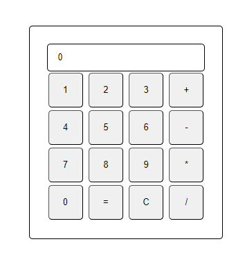

# Calculator
A Calculator using HTML,  CSS and Javascript

## Overview

This basic Calculator has the following features:

- Operations with 2 Numbers
- Add, substract, multiply, divide
- Error message when you try to divide by 0
- Continous operations are possible (e.g.: 1 + 2 + 6 - 5 = 4)
- Behaves like a physical calculator

Possible future Features:

- Possibility to use decimal numbers
- Modolu operator

## Live Page

View the Homepage [here](https://imbajanox.github.io/Calculator/)

## Look

